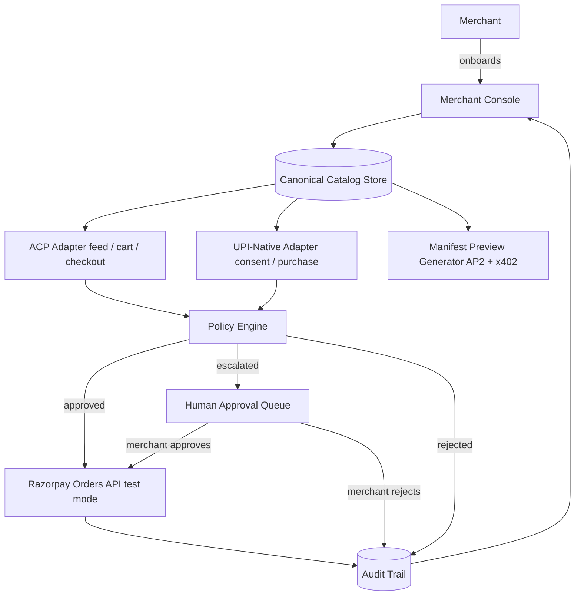

<div align="center">

# 🛂 MerchantPass

### Turn any Razorpay merchant into a business AI shopping agents can actually buy from.

**Track 1 — AI Growth & Agentic Commerce · Razorpay AI Buildathon 2026**

One canonical catalog. One policy engine. One audit trail. Any AI buyer-agent, on whichever commerce protocol it speaks — approved automatically within the merchant's own limits, or escalated to a human instead of silently failing.

 [💻 Explore the Code](#-getting-started) · [📸 See It In Action](#-the-merchant-journey)

</div>

---

```text
Merchant Catalog  →  Agent-Readable Store  →  AI Discovery  →  Cart
      →  Policy Check  →  Checkout  →  Razorpay Order  →  Logged & Explainable
```

---

## 🎯 The Problem

Online stores were built for humans clicking through pages — not for AI agents trying to parse them.

- An AI shopping agent needs a **structured, machine-readable catalog**, not a webpage designed for human eyes.
- It needs a **reliable way to discover** what a merchant sells and at what price, right now.
- It needs a **checkout it can call programmatically** — no forms, no CAPTCHAs, no human in the loop.
- And a merchant needs **all of that to still respect their own rules** — what an agent is allowed to buy, up to how much, and what happens the moment it tries to go further.

At the same time, the industry hasn't picked a winner: OpenAI's **ACP**, Google's **AP2**, Coinbase's **x402**, and NPCI's emerging UPI-native agent pattern are all competing to be how agents transact. A merchant betting on the wrong one integrates the wrong thing.

## 💡 The Solution

```text
BEFORE                              AFTER
──────                              ─────
Merchant                            Merchant
  ↓                                   ↓
Spreadsheet                         Canonical Catalog (imported once)
  ↓                                   ↓
Human-facing store                  Agent-readable commerce layer
  ↓                                   ↓
Human checkout                      AI Agent → Cart → Policy Engine
                                       ↓
                                     Approved → Checkout → Razorpay
                                       ↓
                                     Escalated → Human Approval → Razorpay
                                       ↓
                                     Logged, reasoned, auditable
```

**MerchantPass** sits between a merchant's Razorpay account and any AI buyer-agent. A merchant imports their catalog and sets their own limits once — auto-approval ceiling, blocked SKUs, allowed agents. From there, every purchase attempt from an AI agent is normalized, checked against that policy, and either goes straight through to a real Razorpay order or lands in the merchant's Approval Queue for a one-click human decision. Nothing is a silent black box: every decision, approved or not, is logged with the exact rule that produced it.

## ⚡ What Makes Us Different

| Traditional Store | Agent-Ready Store (MerchantPass) |
|---|---|
| Catalog designed for human eyes | Catalog also exposed in a protocol-correct, machine-readable feed |
| Checkout requires a human at a screen | Checkout callable programmatically by a buyer-agent |
| One integration = one sales channel | One catalog → multiple protocol adapters (ACP live, UPI-native live, AP2/x402 preview) |
| Risk limits are implicit / manual | Risk limits are explicit, merchant-editable, and enforced automatically |
| A risky order either goes through or fails | A risky order gracefully escalates to a human instead of hard-failing |
| "Trust the request" | Order totals are recomputed server-side from the catalog — a spoofed price is caught, not trusted |

**The core differentiator:** the merchant doesn't need to understand ACP, AP2, x402, or UAP to become agent-ready. They manage one catalog and one set of rules — MerchantPass handles the protocol translation underneath.

## 🏆 Why This Fits the Challenge

**Track 1 — AI Growth & Agentic Commerce** asks for a merchant made transactable by an AI buyer end to end, with every money action explainable, bounded, and gated — audit trail included, one failure handled gracefully.

That's the literal shape of this project:

```text
DISCOVER → UNDERSTAND → SELECT → CART → POLICY CHECK → CHECKOUT → PAY → CONFIRM
```

- **Bounded:** every purchase is checked against merchant-set ceilings, blocklists, and agent allow-lists before anything happens.
- **Gated:** exceeding a bound doesn't fail the transaction — it routes to a human approval step.
- **Explainable:** every decision (approved, escalated, or rejected) is written to an audit trail with the exact rule that fired.
- **A failure handled gracefully:** an over-limit order isn't rejected outright — it becomes a one-click approval for the merchant, and a spoofed price is caught and logged rather than silently accepted.
- **Razorpay is the transacting rail:** every approved order creates a real object in Razorpay's test-mode Orders API, verifiable in the Razorpay dashboard.

This is more than a chatbot in front of a store — it's the merchant-side infrastructure that has to exist underneath *any* AI-agent shopping surface, regardless of which protocol wins.

---

## 📸 The Merchant Journey

*From a blank spreadsheet to a live, agent-ready store — in ten frames.*

### 🚪 Onboarding — From Zero to Agent-Ready

<table>
<tr>
<td width="50%" align="center">

**1. Welcome**
<br/><i>Every merchant's first click.</i>
<br/><br/>


</td>
<td width="50%" align="center">

**2. Catalog Setup**
<br/><i>Drag, drop, done — or enter products manually.</i>
<br/><br/>


</td>
</tr>
<tr>
<td width="50%" align="center">

**3. Import Review**
<br/><i>Nothing goes live until the merchant approves it — invalid rows are flagged before products are committed.</i>
<br/><br/>


</td>
<td width="50%" align="center">

**4. You're Live**
<br/><i>Catalog loaded, policies configured, and ready for AI-agent discovery.</i>
<br/><br/>


</td>
</tr>
</table>

### 🖥️ Merchant Console — Running the Store

<table>
<tr>
<td width="50%" align="center">

**5. Live Orders**
<br/><i>Every AI-agent purchase captured and logged as it happens.</i>
<br/><br/>


</td>
<td width="50%" align="center">

**6. Decision Trace**
<br/><i>Not a black box — inspect the exact policy checks behind each order.</i>
<br/><br/>


</td>
</tr>
<tr>
<td width="50%" align="center">

**7. Approval Queue**
<br/><i>The graceful-degradation moment — nothing over the merchant's comfort zone gets silently rejected, it lands here for a human call.</i>
<br/><br/>


</td>
<td width="50%" align="center">

**8. Product Catalog**
<br/><i>The merchant's actual inventory — spreadsheet import or manual SKU entry, not a hardcoded demo list.</i>
<br/><br/>

</td>
</tr>
<tr>

<td width="50%" align="center">

**9. Policy Settings**
<br/><i>Merchant-defined ceilings, blocklists, and agent permissions — the control stays in the merchant's hands.</i>
<br/><br/>


</td>
<td width="50%" align="center">

**10. Agent Channel Readiness**
<br/><i>The honest scoreboard — exactly which AI shopping channels can transact today, and which are already catalog-ready and waiting on the rest of the industry to catch up.</i>
<br/><br/>


</td>
</tr>
</table>

---

## 🤖 The AI Buyer Flow

```text
Customer intent ("buy me 2kg of rice under ₹2,000")
        │
        ▼
AI Shopping Agent (ChatGPT / Claude-style)
        │  discover
        ▼
Agent-Readable Catalog  ──  GET /acp/feed
        │  select + cart
        ▼
Cart  ──  POST /acp/cart
        │  checkout attempt
        ▼
Policy Engine  (SKU validity → stock → blocklist → agent identity →
                velocity → price integrity → value ceiling / consent cap)
        │
   ┌────┴─────┐
   ▼          ▼
Approved   Escalated
   │          │
   ▼          ▼
Razorpay   Human Approval Queue ──► Merchant clicks Approve/Reject ──► Razorpay
   │
   ▼
Order created · Logged to Audit Trail · Visible in Live Orders
```

- **Discover:** the agent reads the merchant's catalog through a protocol-shaped feed, not a rendered webpage.
- **Evaluate & select:** the agent builds a cart against real stock and pricing.
- **Policy validation:** every purchase intent — regardless of which protocol it arrived through — is normalized into one internal shape and run through the same policy engine.
- **Outcome:** approved orders go straight to Razorpay; anything outside the merchant's limits waits for a human, instead of failing outright.

---

## 🔌 Agent Commerce Interface

These are real backend endpoints — not UI-only simulations. A conforming ACP or UPI-native client can call them directly over HTTP.

| Endpoint | Method | Purpose |
|---|---|---|
| `/acp/feed` | `GET` | Agent-readable product feed (ACP-shaped) |
| `/acp/cart` | `POST` | Build a cart from SKUs + quantities |
| `/acp/checkout` | `POST` | Normalize the request, run the policy engine, create the order or escalate |
| `/upi/consent` | `POST` | Register a buyer-agent's one-time, per-merchant spending-cap consent |
| `/upi/purchase` | `POST` | Purchase against a registered consent, enforcing the consent's spending cap |
| `/ap2/preview/:sku` | `GET` | Preview an AP2-shaped mandate chain for a SKU (no live signing) |
| `/x402/preview/:sku` | `GET` | Preview an x402-shaped payment-required response for a SKU (no live settlement) |
| `/audit` | `GET` | Full, reason-coded decision log |
| `/approval/:event_id/approve` | `POST` | Approve an escalated order → creates the Razorpay order |
| `/approval/:event_id/reject` | `POST` | Reject an escalated order |
| `/catalog/import` | `POST` | Bulk import catalog from Excel/CSV, with row-level validation |

**Example — an escalated ACP checkout:**

```json
// POST /acp/checkout
{
  "cart_id": "cart_8f2a...",
  "buyer_agent_id": "chatgpt-shopping-agent-v1",
  "sku": "SKU-001",
  "qty": 4,
  "declared_total_inr": 3596
}
```

```json
// Response
{
  "decision": "escalated",
  "matched_rule": "human_approval_escalation",
  "reason": "Declared total (₹3596) exceeds auto-approve ceiling (₹3000). Escalated for human merchant approval.",
  "razorpay_order_id": null
}
```

Once the merchant approves it from the Approval Queue, the same event updates with `decision: "approved"`, `matched_rule: "human_approved"`, and a real `razorpay_order_id`.

---

## 🏗️ System Architecture



| Component | Role |
|---|---|
| **Canonical Catalog Store** | The single source of truth for SKUs, price, and stock — every adapter reads from here, nothing protocol-specific is stored in it |
| **ACP Adapter** | Real feed/cart/checkout endpoints shaped to the OpenAI + Stripe Agentic Commerce Protocol |
| **UPI-Native Adapter** | Real consent-registration and purchase endpoints modeled on Razorpay + NPCI's live consent-and-spending-cap pilot |
| **Manifest Preview Generator** | Produces correctly-shaped AP2 and x402 payloads from the live catalog, clearly marked as previews |
| **Policy Engine** | The pure decision function every purchase intent passes through, regardless of protocol |
| **Razorpay Orders API** | Where an approved purchase becomes a real, verifiable order (test mode) |
| **Human Approval Queue** | Where anything outside the merchant's bounds waits for a one-click decision instead of failing |
| **Audit Trail** | An append-only, reason-coded log of every decision the system ever made |

---

## 🛡️ Merchant Control & Policy Engine

```text
Agent Purchase Intent
        ↓
Normalize into one internal shape (protocol-agnostic)
        ↓
SKU validity & stock  →  Blocklist  →  Buyer-agent identity/allow-list
        ↓
Velocity check  →  Server-side price recomputation (never trust client total)
        ↓
Order-value ceiling  /  UPI consent spending-cap
        ↓
   ┌────────────┬─────────────┐
   ▼            ▼             ▼
Approved     Escalated     Rejected
(within      (over the     (policy/safety
 limits)      ceiling)      violation)
   │            │             │
   ▼            ▼             ▼
Razorpay    Human Approval  Logged, no
 Order       Queue → then    order created
             Razorpay Order
```

Every one of these controls is merchant-editable from Policy Settings, not hardcoded:

- **Auto-approval ceiling** — orders under this go straight through.
- **Human-approval range** — orders above the ceiling escalate rather than fail.
- **Blocked SKUs** — categories or specific products a merchant doesn't want sold to agents at all.
- **Allowed buyer-agent IDs** — an allow-list, or "allow all" as the default.
- **Velocity limiting** — a basic rate check per buyer-agent.
- **Server-side price integrity** — the order total is recomputed from the catalog's real price before any check runs; a mismatched client-declared total is caught and logged as a tampering attempt, never trusted.
- **Decision Trace** — every one of the above checks is visible per-order, not just the final verdict.

No claim beyond what's implemented here: this is policy enforcement and auditability, not a cryptographic security guarantee.

---

## 💳 Razorpay Payment Flow

```text
Approved Purchase Intent
        ↓
Razorpay Orders API (test mode) — orders.create()
        ↓
Real Order object created, verifiable in the Razorpay Dashboard
        ↓
Order ID stored on the audit event and shown in Live Orders
```

**What's real:** every approved purchase — whether auto-approved or human-approved — creates a genuine Razorpay **Order** via the test-mode Orders API. That order ID is not fabricated; it exists in Razorpay's own dashboard.

**What's intentionally not implemented:** payment *capture*. Razorpay's real capture API requires an existing, checkout-generated payment attempt — which structurally requires a human at a payment screen. That contradicts the core premise of this project, where an AI agent transacts using a pre-authorized token with no human present at transaction time. Rather than fake a capture step or add a human-facing checkout that undermines the "agent transacts silently" model, MerchantPass stops at real, verifiable Order creation and is explicit about that boundary. Live payment capture is listed under Roadmap as the natural next step once real buyer-agent payment tokens (Stripe Shared Payment Tokens / UPI consent-linked mandates) are available via an actual OpenAI/NPCI partnership.

---

## 📊 Agent Channel Readiness

| Channel | Catalog Feed | Cart | Checkout | Status |
|---|---|---|---|---|
| **ACP** (OpenAI + Stripe) | ✅ | ✅ | ✅ | 🟢 **Live** |
| **UPI-native** (Razorpay + NPCI pattern) | ✅ | ✅ (consent-based) | ✅ | 🟢 **Live** |
| **AP2** (Google) | ✅ (preview payload) | — | — | 🟡 **Preview** |
| **x402** (Coinbase + Cloudflare) | ✅ (preview payload) | — | — | 🟡 **Preview** |

The goal here isn't to claim universal protocol support — it's to show exactly what's ready today. AP2 and x402 previews prove the same canonical catalog can already produce protocol-correct output for those ecosystems; live transacting on them needs real signing/facilitator infrastructure that doesn't yet exist for a project without a registered business partnership. NPCI's own Unified Agent Protocol hasn't publicly launched at all (still pending RBI approval) — the UPI-native adapter here is deliberately modeled on the pattern Razorpay and NPCI already shipped live on Claude, not on a spec that doesn't exist yet.

---

## 🧠 Under the Hood

- **Protocol-agnostic core:** every adapter's only job is to translate a protocol-specific request into one internal `PurchaseIntent` shape and translate the policy engine's decision back into a protocol-correct response. This single abstraction is what makes "one backend, many protocols" literally true in code.
- **Policy engine as a pure function:** `evaluatePurchaseIntent(intent, merchantPolicy)` takes an intent and the merchant's current policy and returns a decision plus the exact rule matched — easy to test, easy to reason about, easy to demo live by varying inputs.
- **Server-side price recomputation:** the order total is never taken on faith from the caller — it's recalculated from the catalog's authoritative price on every request.
- **Idempotency on checkout:** resubmitting the same `cart_id` to `/acp/checkout` returns the original cached result instead of creating a duplicate Razorpay order.
- **Persistent audit trail:** decisions are written to disk-backed SQLite, not in-memory state — history survives a server restart.
- **Catalog import pipeline:** Excel/CSV files are parsed server-side, validated row-by-row (missing price, duplicate SKU, non-numeric stock), and only committed after the merchant reviews and confirms.

---

## 🔄 Data Flow

```text
Merchant Spreadsheet / Manual Entry
        ↓
Parser + Row-Level Validation
        ↓
Canonical Catalog (SQLite)
        ↓
Protocol Adapter (ACP feed / UPI consent)
        ↓
AI Buyer-Agent Request
        ↓
Normalized Purchase Intent
        ↓
Policy Engine (5+ sequential checks)
        ↓
   ┌───────────┬────────────┐
   ▼           ▼            ▼
Razorpay    Approval     Audit Trail
 Order       Queue      (all outcomes)
   │           │
   └─────┬─────┘
         ▼
   Merchant Console
   (Live Orders, Decision Trace)
```

---

## 🧪 Proof It Works

- ✅ Guided merchant onboarding (catalog → policy → live)
- ✅ Excel/CSV catalog import with row-level validation before commit
- ✅ Manual catalog CRUD (add / edit / delete SKUs)
- ✅ Agent-readable ACP feed, cart, and checkout endpoints
- ✅ UPI-native consent registration and consent-scoped purchase
- ✅ Multi-check policy engine: SKU validity, stock, blocklist, agent identity, velocity, price-tampering detection, value ceiling, UPI consent-cap enforcement
- ✅ Graceful escalation instead of hard-failure on over-limit orders
- ✅ Human Approval Queue with both Approve and Reject actions
- ✅ Idempotent checkout (no duplicate orders on retry)
- ✅ Persistent, reason-coded audit trail surviving server restarts
- ✅ Per-order Decision Trace showing every policy check that ran
- ✅ Real Razorpay test-mode Order creation, verifiable in the Razorpay dashboard
- ✅ AP2 and x402 preview payload generation from the live catalog
- ⬜ Live payment capture *(intentionally out of scope — see Razorpay Payment Flow above)*
- ⬜ Live inbound traffic from real ChatGPT/Claude agents *(requires an OpenAI/NPCI merchant partnership; exercised instead via spec-conforming terminal test scripts)*

## 📌 Implementation Highlights

- 4 commerce protocols represented: 2 fully live (ACP, UPI-native), 2 honestly previewed (AP2, x402)
- 1 shared policy engine servicing every protocol adapter, not a duplicated rule set per channel
- 1 canonical catalog schema, reshaped — never duplicated — for every protocol-specific output
- Server-side price recomputation on every purchase intent, closing a real spoofing vector

---

## 🛠️ Tech Stack

| Layer | Technology |
|---|---|
| Backend | Node.js + Express |
| Database | SQLite (persisted to disk) |
| Frontend | HTML5 + vanilla JavaScript + CSS (single-page Merchant Console) |
| Payments | Razorpay Node SDK (test mode) |
| Catalog Import | SheetJS (`xlsx`) |
| Agent Test Clients | Standalone Node.js scripts conforming to ACP / UPI-native request shapes |

---

## 📁 Project Structure

```text
merchantpass/
├── src/
│   ├── adapters/
│   │   ├── acp/          # ACP feed / cart / checkout adapter
│   │   ├── upi/          # UPI-native consent / purchase adapter
│   │   └── mocks/        # AP2 / x402 preview generators
│   ├── policy/
│   │   ├── engine.js     # Core evaluatePurchaseIntent() logic
│   │   └── engine.test.js
│   ├── db.js             # SQLite connection + schema
│   └── razorpay.js       # Razorpay Orders API integration
├── public/
│   └── index.html        # Merchant Console UI
├── mock-acp-agent.js     # Terminal test client — ACP scenarios
├── mock-upi-agent.js     # Terminal test client — UPI-native scenarios
├── .env.example
├── .gitignore
└── README.md
```

---

## 🚀 Getting Started

**Prerequisites:** Node.js (v18+), a free [Razorpay test-mode account](https://razorpay.com) for API keys.

```bash
# 1. Clone the repo
git clone https://github.com/<your-username>/merchantpass.git
cd merchantpass

# 2. Install dependencies
npm install

# 3. Configure environment variables
cp .env.example .env
# fill in:
# RAZORPAY_KEY_ID=rzp_test_...
# RAZORPAY_KEY_SECRET=...

# 4. Start the server
npm start

# 5. Open the Merchant Console
# http://localhost:3000
```

On first run, you'll be guided through onboarding — upload or manually enter your catalog, set your policy limits, and you're live.

**Exercising the protocol adapters** (the Merchant Console deliberately has no simulate buttons — it's a real merchant tool, not a test harness):

```bash
node mock-acp-agent.js --sku=SKU-003 --qty=2
node mock-acp-agent.js --scenario=escalation
node mock-acp-agent.js --scenario=reject-blocked-sku
node mock-acp-agent.js --scenario=reject-tampered-price
node mock-upi-agent.js --sku=SKU-001 --qty=1
node mock-upi-agent.js --scenario=consent-cap-exceeded
```

Each script hits the live server over real HTTP, in the same request shape a genuine ACP or UPI-native client would use.

**Running tests:**

```bash
npm test
```

---

## 🗺️ Roadmap

### ✅ Built
- Canonical catalog with Excel/CSV import and manual CRUD
- Multi-check, merchant-editable policy engine with graceful escalation
- Live ACP and UPI-native adapters
- AP2 / x402 preview payload generation
- Persistent, reason-coded audit trail with per-order Decision Trace
- Real Razorpay test-mode Order creation

### 🔜 Next
- Live payment capture once real buyer-agent payment tokens are obtainable (requires OpenAI/NPCI merchant partnership)
- Live AP2 mandate signing via a real facilitator
- Live x402 settlement on a testnet
- Multi-merchant support with per-merchant authentication
- Webhook-based order status push to buyer-agents instead of polling
- Deeper fraud/velocity scoring beyond simple rate limits

---

## 🌍 Why Agentic Commerce Matters

Commerce is shifting:

```text
Human searches → Human clicks → Human checks out
                    becomes
Human intent → AI agent discovers → AI agent evaluates → AI agent transacts
```

Every merchant on Razorpay will eventually face this shift, regardless of which protocol ends up winning — or if none of them do, and the space stays fragmented. The merchants who are ready won't be the ones who bet correctly on ACP versus AP2 versus x402. They'll be the ones whose catalog, risk policy, and payment rail were already built to be protocol-agnostic. That's the infrastructure layer this project is a first version of.

---

## Made by - Garima Dixit

<div align="center">

## 🤖 Commerce is becoming agentic.

### Make your store ready for the next buyer.

**Discover. Decide. Transact.**
 [💻 Explore the Code](#-getting-started)

</div>
